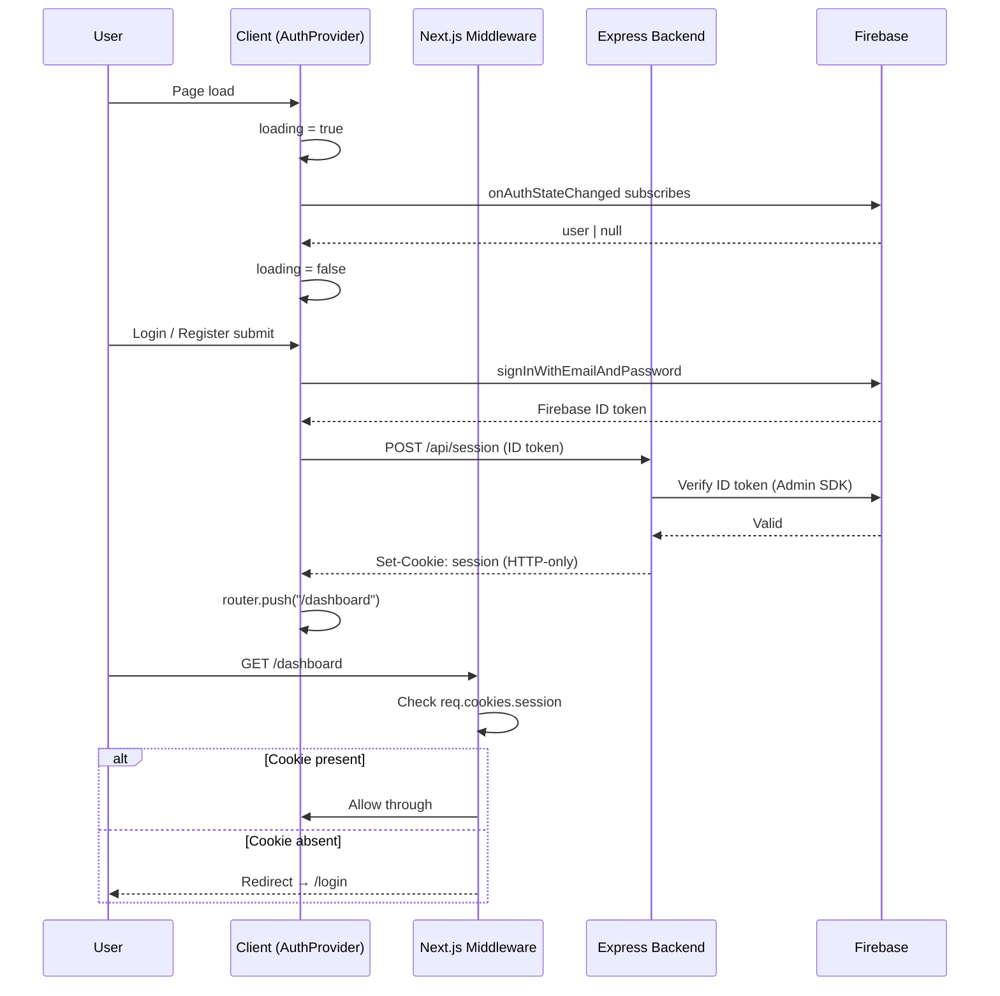

# Auth Architecture

The authoritative synthesis of how authentication works in [[(C) Technology Architecture|Doculyze]]. Compiled from the 2026-05-27 grill-me session, the 2026-05-30 progress notes, and the ChatGPT exchanges on Next.js navigation and cookie s.

## Core principle: two parallel systems

Authentication is handled by **two systems that do not cross-talk**:

| System | Drives | Owner |
|---|---|---|
| `onAuthStateChanged` ([[(C) Firebase\|Firebase]] client) | Client UI rendering — navbar, avatar, page visibility | Frontend |
| Backend [[(C) Session Cookies\|session cookie]] | Route access (middleware) + data access (`requireAuth`) | [[(C) Express\|Express]] |

> The `AuthProvider` never calls the backend. The middleware never reads Firebase state. Each side is independently authoritative for its own concern.

**Why two systems?** The session cookie is **HTTP-only**, so frontend JavaScript cannot read it (see [[(C) Session Cookies|Session Cookies]]). The frontend therefore uses fast Firebase client state for UI, and the backend uses the cookie for security. They are reconciled lazily — only when a protected data call returns `401`.

## Full auth flow



1. User signs in → [[(C) Firebase|Firebase]] returns a [[(C) Firebase ID Token|Firebase ID Token]].
2. Frontend `POST`s the ID token to Express (`POST /api/session`).
3. Express calls `adminAuth.createSessionCookie(idToken)` via the [[(C) Firebase Admin SDK|Firebase Admin SDK]] and sets it as an HTTP-only cookie.
4. Frontend optimistically renders using Firebase client state.
5. Every protected Express route runs `verifySessionCookie()` to authenticate.

## Loading state — three-state model

Never assume auth status before the observer fires. State shape: `{ user: User | null, loading: boolean }`.

```
Page load
    │
    ▼
loading: true ── onAuthStateChanged fires ──▶ user: User  → loading: false
                                           └▶ user: null  → loading: false
```

- `loading: true` — observer hasn't resolved → show skeleton (prevents flash of wrong content).
- `user: null, loading: false` — definitively unauthenticated.
- `user: User, loading: false` — authenticated.

State lives in [[(C) React Context Providers|React Context]] inside `providers.tsx`. `AuthProvider` is a `"use client"` component (it must be — it reads context and uses `useEffect`; see [[(C) Server vs Client Components|Server vs Client Components]]).

## Key design decisions

| # | Question | Decision |
|---|---|---|
| Q1 | Single source of truth? | **Neither** — two parallel systems. `AuthProvider` subscribes to `onAuthStateChanged` only. |
| Q2 | Loading state? | Three-state model (`loading \| User \| null`), skeleton while loading. |
| Q3 | Where does global auth state live? | React Context in `providers.tsx`; consumers call `useAuth()`. |
| Q4 | Protect `/dashboard`? | Next.js Middleware checks `session` cookie **existence** (Edge runtime can't run `firebase-admin`); real verification is at the API layer. |
| Q5 | Who redirects after login? | The **submit handler**, after `createUserSessionOnBackend()` resolves — never the observer (race condition). |
| Q6 | Logout? | `Promise.allSettled([signOut(auth), POST /api/session/logout])` — independent, partial failure tolerated. |
| Q7 | Handle 401 from a protected route? | Centralized `apiFetch` wrapper in `api.tsx` intercepts 401 → `signOut` + `window.location.href = "/login"`. |
| Q8 | Dedicated verify endpoint? | Yes — `GET /api/session/verify` (uses `requireAuth`, returns `{ email, uid }`). Not called on mount. |
| Q9 | Valid Firebase user but expired cookie? | Firebase auto-refreshes its ID token, so the observer stays valid; the only signal is a 401 — resolved by Q7. |

> **The race condition (Q5):** if the observer redirects on login, it fires *before* the session cookie is created → middleware blocks it. The submit handler must own the redirect.

## The 401 reconciliation pattern

```typescript
async function apiFetch(url: string, options?: RequestInit) {
    const response = await fetch(url, { credentials: "include", ...options });
    if (response.status === 401) {
        await signOut(auth);                 // clears Firebase → observer fires null
        window.location.href = "/login";     // hard redirect, no useRouter in a util file
    }
    return response;
}
```

This is the single point where the two systems sync: a backend 401 forces the client back to a clean unauthenticated state.

## Final architecture summary

| Concern | Mechanism |
|---|---|
| Client auth state | `onAuthStateChanged` → `AuthProvider` context |
| Route protection | Next.js Middleware — checks `session` cookie existence |
| Data access protection | `requireAuth` on Express — verifies cookie via [[(C) Firebase Admin SDK\|Firebase Admin SDK]] |
| Loading state | `{ user, loading }`, `loading: true` until observer fires |
| Post-login redirect | Submit handler, after session created |
| Logout | `Promise.allSettled([signOut, POST /logout])` |
| Mid-session 401 | `apiFetch` → `signOut` + hard redirect |
| Session verification | `GET /api/session/verify` (`requireAuth`) |

## Implementation checklist

- [ ] `providers.tsx` — `AuthProvider` with `useEffect` → `onAuthStateChanged`; expose `{ user, loading }`.
- [ ] `_lib/firebase.tsx` — remove module-level `onAuthStateChanged` call.
- [ ] `_lib/api.tsx` — add `apiFetch` with 401 interceptor.
- [ ] `middleware.ts` — check `session` cookie; redirect to `/login` if absent.
- [ ] `backend` — add `GET /api/session/verify` and `POST /api/session/logout`.
- [ ] `login`/`register` pages — redirect in submit handler after session created.

## Related

- [[(C) Technology Architecture|Technology Architecture]] · [[(C) Firebase|Firebase]] · [[(C) Firebase Admin SDK|Firebase Admin SDK]] · [[(C) Session Cookies|Session Cookies]] · [[(C) CSRF Protection|CSRF Protection]] · [[(C) Server vs Client Components|Server vs Client Components]] · [[(C) React Context Providers|React Context Providers]] · [[(C) Firebase ID Token|Firebase ID Token]]
