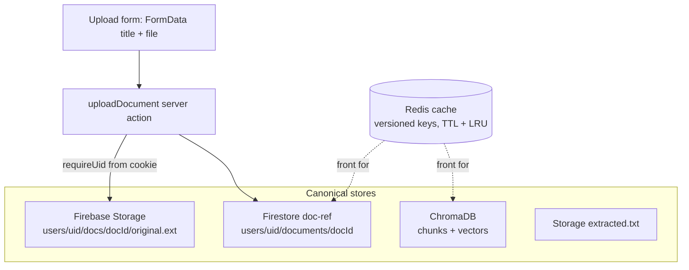

# Document Ref Storage — Grill-Me Session

> [!abstract] Starting question
> **"Should I use Realtime Database or Cloud Firestore for document ref storage?"**
>
> Answer: **Cloud Firestore** — and the decision cascaded into replacing MongoDB,
> a Storage + Chroma + Redis split, a subcollection data model, and a
> session/DAL auth refactor. Most of the supporting code landed tonight;
> `upload_document.tsx` itself is left for tomorrow.

---

## TL;DR — Final Architecture

| Concern | Store | Notes |
|---|---|---|
| Document **metadata / refs** | **Cloud Firestore** | Replaces MongoDB. Subcollection `users/{uid}/documents/{docId}` |
| **Raw file bytes** | Firebase **Storage** (GCS) | `users/{uid}/docs/{docId}/original.<ext>` |
| **Canonical extracted text** | Firebase **Storage** | `extracted.txt` — survives re-chunk / embedding-model swap |
| **Chunk text + vectors** | **ChromaDB** | chunk text stored as the payload alongside the vector |
| **Cache** (content, context, answers) | **Redis** | pure cache, never source of truth |

> [!warning] MongoDB is dropped
> `[[PLAN]]` and `[[CLAUDE]]` still name MongoDB as the document store. That is
> now **superseded** — Firestore (metadata) + Storage (bytes) + Chroma (chunks)
> cover everything Mongo was going to do. Update those docs when convenient.

---

## Decision Log

| # | Question | Decision | Why |
|---|---|---|---|
| 1 | RTDB vs Firestore; what is the "doc ref" for? | **Firestore**, role = pointer/metadata **and** it **replaces Mongo** | Records are document-shaped & queried by owner; Firestore has indexed queries + per-doc rules; RTDB's edge (high-freq streaming) isn't the workload |
| 2 | Where do bytes + text live now Mongo's gone? | **Storage** for raw files + **Chroma** for chunk text, **+ `extracted.txt`** in Storage | Firestore doc cap is **1 MiB** — can't hold a real PDF. Chroma already must store chunk text for retrieval |
| 3 | Redis key design / invalidation | **Versioned keys** (`doc:{docId}:v{ver}:...`) + **normalized exact-match** questions + **TTL & `allkeys-lru`** | Version on the Firestore record → re-process bumps `ver` → stale entries unreachable, age out. Semantic cache deferred (correctness landmine) |
| 4 | Collection layout + doc id | **Subcollection** `users/{uid}/documents/{docId}` + **server-generated random id** | Ownership is structural (no "forgot owner filter" leak); id is the stable handle for Storage paths / Chroma / Redis keys — never the human title |
| 5 | What does the DAL own? | **Auth + data** (Next.js DAL pattern) | uid always derived from verified cookie inside the DAL; callers can't pass/forge a uid |
| 6 | How do bytes reach Storage? | **(A)** through the server action, **`bodySizeLimit` bumped** | Smallest path to a working upload; keeps auth server-side. Direct client→Storage signed-URL flow is the later scale path |

---

## What shipped tonight

- [x] `next.config.ts` — `experimental.serverActions.bodySizeLimit = "15mb"` (default 1 MB would reject real PDFs). *Verified against the bundled Next 16 docs.*
- [x] `_lib/admin.tsx` — added `getStorage`, `storageBucket: process.env.FIREBASE_STORAGE_BUCKET`, exported `storage`. (Firestore export is `db`.)
- [x] `_lib/session.tsx` — **NEW** server-only primitives:
  - `getSession(checkRevoked)` — verifies `refresh` cookie, wrapped in React `cache()` (dedupe per request)
  - `getCurrentUid()` → `string | null` (reads)
  - `requireUid(checkRevoked=true)` → throws if unauth (writes; what the DAL calls)
- [x] `_lib/database.tsx` — **NEW** DAL: `createDocumentRecord()`, `listDocuments()`, `DocStatus`, `DocumentRecord`. Derives uid internally, scopes to the subcollection, auto-id, sets `status:"uploaded"`, `version:1`.
- [x] `verify_user.tsx` — kept the boolean `verifyUser()` gate (now delegates to `getCurrentUid()`); added `redirectToLogin()` returning uid.

> [!note] Module-name reconcile needed
> `verify_user.tsx` imports `getCurrentUid` from **`@/_lib/data`**, but the
> primitives were written to **`_lib/session.tsx`** (and the DAL is
> `_lib/database.tsx`). Pick one name and make the import resolve, or the build
> breaks. — see follow-ups.

### Bugs found in the old stub (`upload_document.tsx`)
- Keyed the Firestore doc by **user-supplied `title`** → collisions, illegal `/`, silent overwrite via `{merge:true}`.
- `const userId = await verifyUser()` → `verifyUser` returns a **boolean**, not a uid.
- Used **client-SDK** `doc()/setDoc()` against the **Admin** SDK `firestore`/`db` — can't run.

---

## Open / Follow-ups

- [ ] **`upload_document.tsx` rewrite** *(user, tomorrow)* — `requireUid()` → `storage.bucket().file('users/'+uid+'/docs/'+docId+'/original.'+ext).save(buffer,{contentType})` → `createDocumentRecord({title, storagePath, contentType, size})`. Note: id must exist before the Storage path → mint the doc ref id first (`documentsCol(uid).doc().id`) or restructure.
- [ ] **Create the Storage bucket** + set `FIREBASE_STORAGE_BUCKET` in `.env.local` (usually `<projectId>.firebasestorage.app` or `<projectId>.appspot.com`). Until then, uploads throw.
- [ ] **Reconcile `_lib/data` vs `_lib/session` / `_lib/database`** import path (see note above).
- [ ] **Lock `firestore.rules`** to deny all client access (Admin-SDK-only architecture; rules are bypassed by Admin, so server-action ownership checks are the real authz).
- [ ] **Redis layer** — not yet built; implement versioned keys + normalized exact-match + TTL & `allkeys-lru`.

### Parked (explicitly, for another session)
- [ ] **Multi-store write ordering + `status`/`version` lifecycle** on upload (Firestore record → Storage → Python embed → Chroma), incl. orphan/failure handling.
- [ ] **Node ↔ Python handoff** — the Python RAG worker needs to write Firestore `status`/`version` + Chroma; either give it its own Firestore-Admin access in Python, or Node mediates all Firestore writes and Python only talks to Chroma.
- [ ] **Semantic answer cache** — only after exact-match hit-rate is measured and there's eval coverage to catch bad hits.

---

## Related
- [[GRILL-ME-auth-state-2026-05-27]] — prior session on AuthProvider / cookie-driven header (the `verifyUser` / session-cookie groundwork this builds on)
- [[Auth-State-Context-and-Effects]]
- [[PLAN]] · [[CLAUDE]] — update to drop MongoDB
