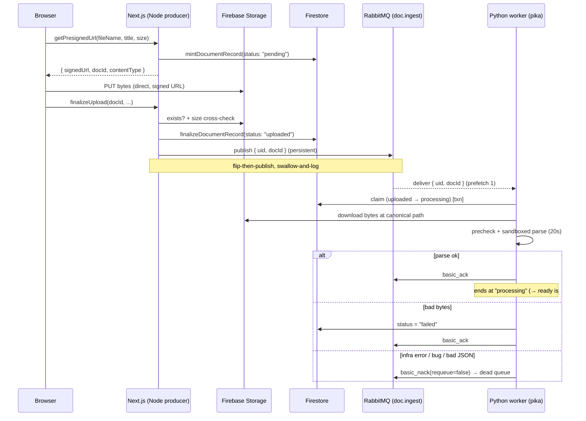

# (C) Node-to-Python Ingest Job Flow (RabbitMQ)

How a document upload in the **Next.js (Node) process** hands a job off to the
**Python ingest worker** without ever shipping bytes across the wire. The two
processes never call each other directly — they're decoupled by a durable
**RabbitMQ queue**. Node is the **producer**, Python is the **consumer**, and the
only thing that crosses is a tiny **pointer envelope**.

Related: [[Current Architecture]] · [[RAG Pipeline]] · [[(C) AI Layer Backend Language (DECISION)|AI Layer is Python]] · [[Why Mint First Beats Mint After (DECISION)]]

---

## The one-paragraph version

After a file's bytes land in Storage and its Firestore record flips to
`uploaded`, the Node server publishes a message `{ uid, docId }` onto the durable
queue **`doc.ingest`**. That's the entire payload — two strings, a *pointer*, not
the file. The Python worker is subscribed to that queue; RabbitMQ pushes the
message to it, the worker claims the doc, downloads the bytes from Storage
itself, parses them, and acks the message. If the worker is down, the message
waits in the queue until it comes back. If Node is down, the queue just doesn't
grow. Neither side blocks on the other.

---

## Why a queue at all? (the mental model)

Three properties we get for free by putting a broker in the middle:

1. **Temporal decoupling.** The producer and consumer don't have to be alive at
   the same time. Upload at 2am with the worker offline → the job sits durably in
   the queue → the worker drains it when it boots. A direct HTTP call would just
   fail.
2. **Load leveling.** Ten uploads in a burst enqueue ten messages; the worker
   pulls them **one at a time** (`prefetch=1`) at its own pace. The queue is the
   buffer, so a slow parse never backs up the upload UX.
3. **Language decoupling.** Node speaks to Python without either importing the
   other. The contract is just "a JSON blob with two fields on a named queue."
   The Python layer is Python for good reasons (see
   [[(C) AI Layer Backend Language (DECISION)|AI Layer is Python]]); the queue is
   what lets those two runtimes cooperate.

**The golden rule here: the message is a *pointer, never the payload.*** We send
`{uid, docId}`, not the PDF. Bytes live in Storage; the worker fetches them from
the canonical path. This keeps messages tiny, keeps the broker cheap, and means
Storage stays the single source of truth for file bytes.

---

## The pieces (AMQP vocabulary)

RabbitMQ implements **AMQP 0-9-1**. Four nouns you need:

| Term | What it is | In our system |
|------|-----------|---------------|
| **Queue** | A durable buffer messages sit in until consumed | `doc.ingest` |
| **Exchange** | A router that decides which queue(s) a message lands in | `doc.ingest.dlx` (dead-letter) |
| **Binding** | A rule linking an exchange to a queue by a **routing key** | `dead ← dlx` on key `doc.ingest` |
| **Message** | The bytes + properties (persistent flag, content-type) | `{uid, docId}` JSON |

Two durability concepts that are easy to conflate:

- **`durable: true` on a queue** = the *queue definition* survives a broker
  restart. Without it, the queue itself vanishes when RabbitMQ restarts.
- **`persistent: true` on a message** = *this message* gets written to disk, so
  it survives a broker restart too.

You need **both** for an at-least-once guarantee across a broker crash — a
persistent message in a non-durable queue still dies with the queue, and a
durable queue full of non-persistent messages loses its contents on restart. We
set both.

---

## End-to-end sequence



---

## Node producer side

Three files, three responsibilities:

### 1. `_lib/rabbitmq.ts` — owns the connection + topology

This is the only module that touches `amqplib` and knows the broker exists. It
opens a **connection** (a TCP socket to RabbitMQ), opens a **channel** (a
lightweight virtual connection multiplexed over that socket — you do all real
work on a channel, never the raw connection), and **declares the topology**:

```ts
await ch.assertExchange(DLX, "direct", { durable: true });   // dead-letter exchange
await ch.assertQueue(DEAD_QUEUE, { durable: true });          // where poison msgs go
await ch.bindQueue(DEAD_QUEUE, DLX, QUEUE);                   // dlx --key doc.ingest--> dead
await ch.assertQueue(QUEUE, {                                 // the main work queue
  durable: true,
  arguments: { "x-dead-letter-exchange": DLX },               // failures route to DLX
});
```

**`assert*` is declare-if-absent, verify-if-present** — idempotent. Calling it
when the queue already exists is a no-op *unless the arguments disagree*, in
which case it **hard-fails**. That failure is a feature: it's the alarm that the
producer and consumer have drifted out of sync (see "topology must match" below).

**`x-dead-letter-exchange`** wires the main queue's failures to the DLX: when the
worker rejects a message with `requeue=false`, RabbitMQ automatically republishes
it to `doc.ingest.dlx`, which the binding routes into `doc.ingest.dead`. That's
our poison-message drain.

> [!warning] Current connection model & its gap
> `rabbitmq.ts` currently opens **one** connection at module load via top-level
> `await` and caches it as a singleton (`prod`). This pools the connection
> (good — no reconnect per upload) but **discards the self-healing** the old
> connection-per-publish model had: if the broker restarts, the cached channel
> is dead, there's no reconnect logic, and there are **no `'error'`/`'close'`
> listeners** on the connection — an unhandled `'error'` event in amqplib can
> crash the Node process. The chosen fix (grill 2026-07-19) is **lazy +
> self-healing**: a `getChannel()` that connects on first use, attaches
> `error`/`close` handlers that null the cache, so the next publish transparently
> reconnects. Tracked as an open next-step.

### 2. `_lib/ingest_broker.ts` — the publish verb

The broker-agnostic shell. Everything above this line could swap RabbitMQ for
another broker and only these two files (this + the worker's consumer) change.

```ts
const body = Buffer.from(JSON.stringify({ uid, docId })); // exactly two fields
const ok = ch.sendToQueue(QUEUE, body, {
  persistent: true,             // write to disk — survives broker restart
  contentType: "application/json",
});
if (!ok) await new Promise((resolve) => ch.once("drain", resolve));
```

`sendToQueue` publishes straight to a queue by name (via the AMQP **default
exchange**, no explicit exchange needed). It returns a **boolean** = "is the
internal write buffer still accepting?" `false` means backpressure — the socket
buffer is full — so we wait for the `'drain'` event before continuing. For our
human-paced uploads this basically never trips, but it's the correct handling.

**`RABBITMQ_URL` unset = ingest disabled.** No connect attempt, one quiet log.
This is what lets a plain `npm run dev` (no Docker, no broker) run without an
error storm — the upload just rests at `uploaded`, recoverable later.

### 3. `finalizeUpload` (in `upload_document.tsx`) — the call site & failure policy

```ts
// ... record is already flipped to "uploaded" and committed to Firestore ...
try {
    await publishIngestJob(uid, docId);
} catch (err) {
    console.error("ingest enqueue failed; doc stuck at uploaded:", docId, err);
}
```

Two deliberate design choices packed in here:

- **Flip-then-publish.** Firestore is committed to `uploaded` *before* we publish.
  The DB record is the durable source of truth; the queue message is only a
  *notification* to go process it. Order matters: if we published first and the DB
  write failed, we'd have a job pointing at a doc that isn't ready.
- **Swallow-and-log (this `try/catch` is *outside* the rethrowing one).** A broker
  outage must **never** surface as a failed upload. The user's file is safely in
  Storage and recorded as `uploaded`; a missing queue message just means the doc
  is "stuck-but-recoverable," not lost. A future re-publish sweep (sibling issue
  #9) can pick up any `uploaded` docs that never got ingested.

---

## Python consumer side (`ingest-worker/src/ingest/consumer.py`)

The worker uses **`pika`** — the standard Python AMQP client (Python can't use
`amqplib`; that's Node-only, but both speak the same AMQP 0-9-1 to the same
broker). Key setup:

```python
channel.basic_qos(prefetch_count=1)   # at most one unacked message in flight
channel.basic_consume(queue=queue, on_message_callback=on_message, auto_ack=False)
```

- **`prefetch_count=1`** — RabbitMQ won't hand this worker a second message until
  the current one is acked. This is the load-leveling knob: one document parsed
  at a time.
- **`auto_ack=False` (manual ack)** — the message is only removed from the queue
  when *we* say so. This is what makes delivery **at-least-once**: if the worker
  crashes mid-parse, the message was never acked, so RabbitMQ **redelivers** it to
  the next worker.

The ack decision (in `on_message`):

```python
try:
    envelope = json.loads(body)
    run_ingest_job(envelope)
    channel.basic_ack(delivery_tag=method.delivery_tag)        # done
except Exception:
    channel.basic_nack(delivery_tag=method.delivery_tag, requeue=False)  # → dead queue
```

The subtle policy: **document-level failures don't reach this except block.**
A bad PDF is handled *inside* `run_ingest_job` (it writes `failed` to Firestore
and returns normally) → we still **ack**, because the message did its job. Only
**infra failures, bad JSON, or actual bugs** hit the `except` → **nack with
`requeue=false`** → dead-letter queue.

`requeue=false` is critical: requeuing a poison message in place would create an
infinite redelivery loop (parse fails → requeue → parse fails → …). Instead it
goes to `doc.ingest.dead`, which is a **pure alarm** — a message in the dead
queue always means "worker/infra is broken," never "user uploaded a bad file."

### The redelivery safety net

Because acks are manual and `prefetch=1`, a crash mid-job leaves the delivery
unacked → RabbitMQ redelivers it → the worker's Firestore **claim** transaction
sees the doc already at `processing` → returns **RERUN** (safe re-entry) instead
of double-processing. The claim (`uploaded → processing`, with `ready`/`failed`
never regressing) is what makes redelivery idempotent.

---

## Topology must match on both sides

The Node producer (`rabbitmq.ts`) and the Python consumer (`consumer.py`) **each
declare the full topology** — the same exchange, queues, bindings, and
`x-dead-letter-exchange` argument. Whichever process boots first creates it; the
second one's `assert*` **verifies** it matches.

This is intentional redundancy: either side can start first (worker before web,
or web before worker), and neither depends on the other having run. But it means
the two declarations **must stay byte-for-byte identical**. If someone changes
the queue arguments on one side only, the other side's `assertQueue` throws on
next boot — a loud, immediate drift alarm rather than a silent misroute.

> [!tip] If you change queue topology
> Change it in **both** `doculyze/_lib/rabbitmq.ts` and
> `ingest-worker/src/ingest/consumer.py` in the same commit, or the next restart
> will hard-fail on the mismatch.

---

## Failure modes at a glance

| What breaks | What happens | Doc ends up |
|-------------|-------------|-------------|
| Broker down at publish | `publishIngestJob` throws, swallowed & logged | `uploaded` (recoverable via #9 sweep) |
| `RABBITMQ_URL` unset | No publish attempt, one info log | `uploaded` |
| Worker down | Message waits durably in `doc.ingest` | `uploaded` → picked up on worker boot |
| Worker crashes mid-parse | Unacked msg redelivered; claim sees `processing` → RERUN | reprocessed safely |
| Bad file bytes | `run_ingest_job` writes `failed`, **acks** | `failed` (object retained) |
| Bug / bad JSON / infra error | **nack(requeue=false)** → `doc.ingest.dead` | stays wherever it was; DLQ depth alarms |

---

## Takeaways

- **Node is the producer, Python is the consumer, RabbitMQ is the seam** — neither
  language imports the other; the contract is a named queue + a 2-field JSON blob.
- **Pointer, never payload** — `{uid, docId}` crosses; bytes stay in Storage.
- **Durable queue + persistent message** = survives a broker restart (need both).
- **Manual ack + prefetch 1** = at-least-once delivery with one-at-a-time
  leveling; redelivery is made safe by the Firestore claim (RERUN).
- **`requeue=false` → dead-letter queue** = poison messages drain to an alarm, no
  infinite loops.
- **Flip-then-publish, swallow-and-log** = a broker outage can never fail an
  upload; the doc rests recoverable at `uploaded`.
- **Open gap:** the producer connection is an eager cached singleton with no
  reconnect/error handlers — moving to lazy + self-healing `getChannel()`.
