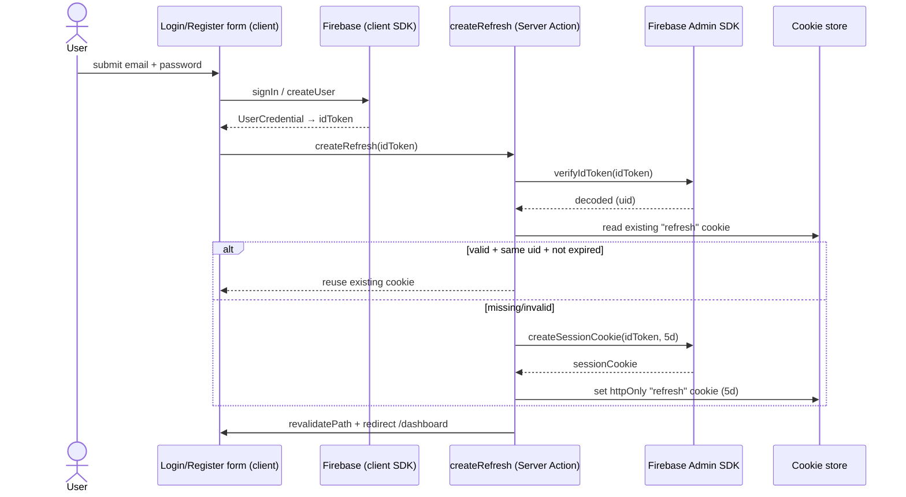

# DocuLyze — Architecture

> [!abstract] What this is
> DocuLyze is a planned **RAG document-analysis tool** (upload PDFs/Word docs, chat over them).
> Today **only authentication is implemented**. This note maps the auth architecture as it
> *actually exists in the code*, flags where it diverges from the written plan, and lists what is
> still stubbed or dead.

> [!warning] Doc-vs-code drift (read this first)
> `CLAUDE.md` / `PLAN.md` describe a **separate Express backend** (`backend/`) that handles auth via
> REST + CSRF + session cookies. **The frontend no longer calls it.** Auth has been re-implemented
> inside the Next.js app as **Server Actions** using the Firebase Admin SDK. The Express server and
> `_lib/api_with_express.tsx` are now **legacy / superseded**. See [[#Legacy & dead code]].

---

## Tech stack

| Layer | Choice | Version | Where |
|---|---|---|---|
| Framework | Next.js (App Router) | 16.2.6 | `doculyze/` |
| UI | React | 19.2.4 | `app/`, `components/` |
| Styling | Tailwind | v4 | `globals.css` |
| Language | TypeScript | ^5 | everywhere (`.tsx`) |
| Auth (client) | Firebase JS SDK | ^12.13 | `_lib/firebase.tsx` |
| Auth (server) | Firebase Admin SDK | ^13.10 | `_lib/admin.tsx` |
| Doc store (started) | Firestore (client SDK) | via firebase | `upload_document.tsx` |

> [!note] Planned but absent
> LangChain RAG pipeline (Python), Google NLP (NER/sentiment), Redis cache, MongoDB, ChromaDB,
> Google OAuth. None have code yet — see [[#Roadmap / not yet built]].

---

## Module map

```
doculyze/
├── _lib/
│   ├── firebase.tsx          # Client SDK init → exports `auth`, `firestore`
│   ├── admin.tsx             # Admin SDK init (server-only) → exports `adminAuth`
│   ├── observers.tsx         # onAuthStateChanged → AuthContext (currently unused)
│   ├── database.tsx          # EMPTY
│   └── api_with_express.tsx  # LEGACY: fetch() wrappers to Express backend
├── app/
│   ├── layout.tsx            # Root layout: <AuthProvider> + <Header>
│   ├── providers.tsx         # AuthContext (useAuth / AuthProvider)
│   ├── page.tsx              # Landing (still CRA boilerplate)
│   ├── login/                # page.tsx + login_form.tsx
│   ├── register/             # page.tsx + register_form.tsx
│   ├── actions/
│   │   ├── auth/
│   │   │   ├── session.tsx          # createRefresh / createAccess / revokeSession
│   │   │   ├── verify_user.tsx      # verifyUser (session-cookie guard)
│   │   │   └── form_validation.tsx  # validateEmailAndPassword
│   │   └── document/
│   │       └── upload_document.tsx  # STUB write to Firestore
│   ├── (protected)/          # Route group, auth-gated by its layout
│   │   ├── layout.tsx        # verifyUser() → redirect /login
│   │   ├── dashboard/page.tsx
│   │   └── upload/           # page + upload_form.tsx
│   ├── actions.tsx           # DEAD (imports missing createSession)
│   ├── middleware/auth_check.tsx  # DEAD (broken imports)
│   └── pages/login/index.tsx      # DEAD (stray Pages-router file)
└── components/
    ├── header.tsx            # Auth status + signout
    ├── button.tsx            # SubmitButton (useFormStatus)
    └── form.tsx
```

Related: [[#Two Firebase SDKs]] · [[#Legacy & dead code]]

---

## The two halves of Firebase

### Two Firebase SDKs
DocuLyze uses **both** Firebase SDKs, split by trust boundary:

- **Client SDK** (`_lib/firebase.tsx`) runs in the browser. It owns the *credential* operations:
  `signInWithEmailAndPassword`, `createUserWithEmailAndPassword`, and produces a short-lived
  **ID token**. Also exports `firestore` for client writes.
- **Admin SDK** (`_lib/admin.tsx`, marked `import "server-only"`) runs only on the server inside
  Server Actions. It owns the *trust* operations: `verifyIdToken`, `createSessionCookie`,
  `verifySessionCookie`, `revokeRefreshTokens`.

The handoff between them is the **ID token**: the browser proves identity to Firebase, gets an ID
token, and passes it to a Server Action which mints a long-lived **session cookie**. See
[[#Auth flow]].

> [!bug] Init smells to fix
> - `firebase.tsx`: `getFirestore()` is called with no app argument and the hardcoded `firebaseConfig`
>   (incl. API key) is committed in source.
> - `admin.tsx`: builds a `serviceAccountFromEnv` from env vars but then **ignores it**, still
>   `cert()`-ing the committed `serviceAccountKey.json`. The env path is the intended migration.

---

## Auth flow

The live flow is **client credential → Server Action → httpOnly session cookie**.



### Session model (intended vs. live)
The code sketches a **two-tier token model**:

- `refresh` cookie — 5-day session cookie, httpOnly, `sameSite=strict`, `secure=true`. **Live.**
- `access` cookie — 15-minute cookie via `createAccess()`. **Defined but never invoked** — the
  short-lived-access half of the pattern isn't wired in yet.

### Route protection
- **Server-side guard:** `app/(protected)/layout.tsx` awaits `verifyUser()` and `redirect("/login")`
  if it returns false. `verifyUser()` reads the `refresh` cookie and calls
  `verifySessionCookie(..., true)` (checkRevoked). Every page under `(protected)/` inherits this.
- `dashboard/page.tsx` *also* calls `verifyUser()` itself (belt-and-suspenders / redundant with the
  layout).
- `app/middleware/auth_check.tsx` looks like an attempt at Next.js middleware-based protection but
  is **dead** (broken imports: `refresh` from `next/cache`, `create` from `domain`).

### Sign-out
`components/header.tsx` → `auth.signOut()` (client) then `revokeSession()` (Server Action) →
`revokeRefreshTokens(uid)` + delete `refresh`/`access` cookies + `redirect("/login")`.

---

## Client-side auth state

Two parallel mechanisms exist for tracking "who is logged in" on the client — and they **don't share
state**:

1. **Context** — `app/providers.tsx` defines `AuthContext` (`useAuth`, `AuthProvider`), and
   `_lib/observers.tsx` has an `onAuthStateChanged` subscriber meant to push the user into it.
   `AuthProvider` wraps the app in `layout.tsx`, **but `observers.tsx` is never mounted**, so the
   context stays at its default empty user.
2. **Local component state** — `header.tsx` ignores the context (the `useAuth()` line is commented
   out) and runs its *own* `onAuthStateChanged` + `verifyUser()` to render "Welcome {email}".

> [!tip] Consolidation opportunity
> Pick one: either mount the `observers.tsx` subscriber and have `Header` consume `useAuth()`, or
> delete the context. Right now the provider is dead weight and the observer logic is duplicated.

---

## Legacy & dead code

> [!danger] Candidates for deletion / decision
> These exist but are not part of the live auth path:
>
> - **`backend/`** (Express server, `apiFunctions.js`, `middleware.js`, `admin.js`) — the original
>   REST + CSRF + session-cookie design. Superseded by Server Actions. Still what `CLAUDE.md`
>   documents.
> - **`_lib/api_with_express.tsx`** — `fetch()` wrappers to `localhost:5000`. Unused.
> - **`app/actions.tsx`** — imports a non-existent `createSession`.
> - **`app/middleware/auth_check.tsx`** — broken imports, never registered.
> - **`app/pages/login/index.tsx`** — stray Pages-router artifact.
> - **`_lib/database.tsx`** — empty file.
>
> Decide per item: delete, or revive intentionally. Then update `CLAUDE.md`/`PLAN.md` so the docs
> describe the Server-Action architecture.

---

## Document upload (first non-auth feature, stubbed)

`app/(protected)/upload/upload_form.tsx` posts to the `uploadDocument` Server Action, which currently
writes **hardcoded placeholder data** (a "vanilla latte" object) to a Firestore `documents`
collection. No file is actually read or stored. This is the seam where the [[#Roadmap / not yet built|RAG pipeline]] will eventually attach.

---

## Roadmap / not yet built

From `PLAN.md`, none of these have code yet:

- [ ] RAG pipeline (Python / LangChain)
- [ ] Google Natural Language API — NER + sentiment
- [ ] Redis — AI context / session / uploaded-doc cache
- [ ] MongoDB — uploaded document storage
- [ ] ChromaDB — vector store
- [ ] Google OAuth (only email/password exists today)
- [ ] Real document upload + chat interface

---

## Open questions / next decisions

- Commit to **Server Actions** and retire the Express backend? (Update docs either way.)
- Wire up the `access` (15-min) cookie, or simplify to a single `refresh` cookie?
- Unify client auth state (context vs. per-component observer).
- Move Firebase config + admin credentials to env vars before any deploy.

---

_Related notes:_ [[DocuLyze — RAG Pipeline]] · [[DocuLyze — Data Stores]] · [[Firebase Auth patterns]]
_(placeholders — create as the project grows)_
