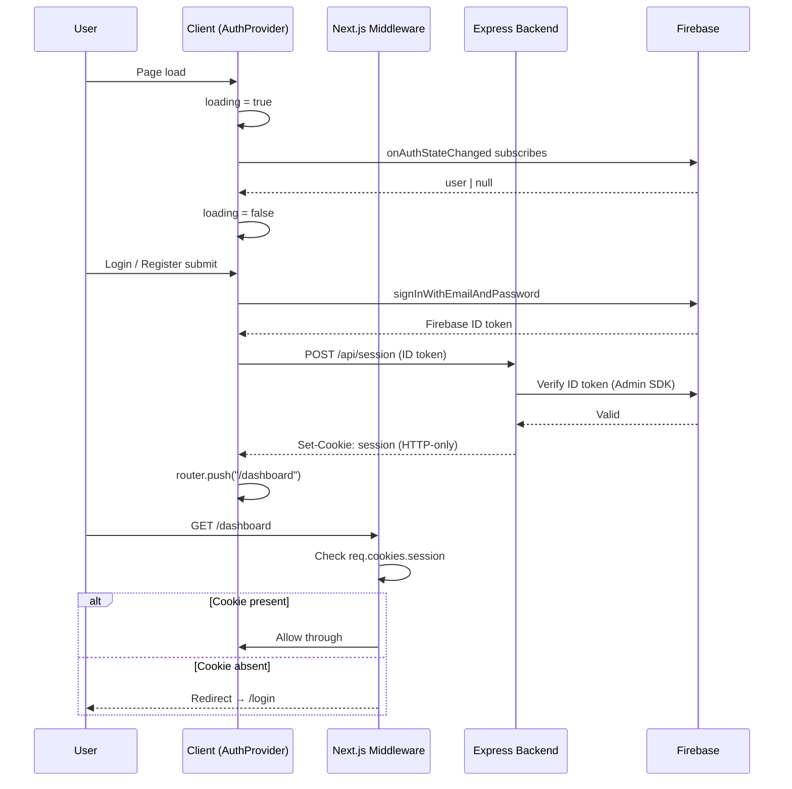
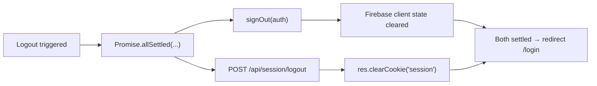

# Auth State Architecture
**Grill-Me Session** · 2026-05-27  
**Topic:** Global auth state, session management, and route protection

---

## Core Principle

Two parallel systems handle authentication — they do **not** cross-talk:

| System                          | Drives                                                  |
| ------------------------------- | ------------------------------------------------------- |
| `onAuthStateChanged` (Firebase) | Client UI rendering, navbar, page visibility            |
| Backend session cookie          | Route access (middleware) + data access (`requireAuth`) |

> `AuthProvider` never calls the backend. Middleware never reads Firebase state.

---

## Auth Flow



---

## Loading State

Three-state model — never assume authentication status before the observer fires.

```
Page load
    │
    ▼
loading: true  ──── onAuthStateChanged fires ────▶  user: User   →  loading: false
                                                 └▶  user: null  →  loading: false
```

State shape: `{ user: User | null, loading: boolean }`

- `loading: true` — observer hasn't resolved yet → show skeleton
- `user: null, loading: false` — definitively not authenticated
- `user: User, loading: false` — authenticated

---

## Q&A Decisions

### Q1 — Single source of truth for "is this user authenticated"?
**Neither exclusively.** Two parallel systems (see Core Principle above). `AuthProvider` subscribes to `onAuthStateChanged` only — it never pings the backend.

### Q2 — How to handle auth loading state?
**Three-state model** (`loading | User | null`). UI shows a skeleton while `loading: true`. This prevents flash of wrong content.

### Q3 — Where does global auth state live?
**React Context in `providers.tsx`.** `AuthProvider` is a `"use client"` component that wraps `{children}` in `layout.tsx`. Consumers call `useAuth()`.

> The `onAuthStateChanged` call at module level in `_lib/firebase.tsx` must be removed and moved into a `useEffect` inside `AuthProvider`.

### Q4 — How to protect `/dashboard` from unauthenticated access?
**Next.js Middleware (`middleware.ts`).** Checks `req.cookies.get("session")` — if absent, redirects to `/login`. No cryptographic verification in middleware (Edge Runtime can't run `firebase-admin`). Real verification is at the API layer. A secondary `useAuth()` guard in the layout acts as a mid-session safety net.

### Q5 — Who redirects to `/dashboard` after login?
**The submit handler** — after `await createUserSessionOnBackend(...)` resolves. The observer only restores state on cold page loads.

> If the observer redirects, it fires before the session cookie is created → middleware blocks it. Race condition.

### Q6 — Logout sequence?



`Promise.allSettled` — both operations are independent; partial failure is tolerated.

### Q7 — How to handle 401 from a protected backend route?
**Centralize in `api.tsx`.** A fetch wrapper intercepts all 401s:

```typescript
async function apiFetch(url: string, options?: RequestInit) {
    const response = await fetch(url, { credentials: "include", ...options });
    if (response.status === 401) {
        await signOut(auth);
        window.location.href = "/login";
    }
    return response;
}
```

On 401: `signOut(auth)` clears Firebase state → `onAuthStateChanged(null)` → `AuthProvider` resets to `{ user: null, loading: false }`. Hard redirect via `window.location.href` avoids `useRouter` hook dependency in a utility file.

### Q8 — Dedicated session-verification endpoint?
**Yes — `GET /api/session/verify`.** Uses `requireAuth`, returns `{ email, uid }` on 200, 401 if invalid.

> `AuthProvider` does **not** call this on mount. It exists as a clean protected route for other purposes. (Original assumption that `AuthProvider` would ping the backend was invalidated in Q1.)

### Q9 — What if `onAuthStateChanged` reports a valid user but the session cookie expired mid-session?
Firebase auto-refreshes its ID token, so the observer keeps reporting valid even after the backend cookie expires. The only signal is a 401 from a data call.

**Resolved by Q7** — `apiFetch` catches the 401, `signOut` syncs client state, redirect to `/login`. No additional handling needed.

---

## Final Architecture Summary

| Concern | Mechanism |
|---|---|
| Client auth state (`user`, `loading`) | `onAuthStateChanged` → `AuthProvider` React Context |
| Route protection | Next.js Middleware — checks `session` cookie existence |
| Data access protection | `requireAuth` on Express routes — verifies cookie via Firebase Admin SDK |
| Loading state | `{ user: User \| null, loading: boolean }` — `loading: true` until observer fires |
| Post-login redirect | Submit handler — after `createUserSessionOnBackend` resolves |
| Logout | `Promise.allSettled([signOut(auth), POST /api/session/logout])` |
| Mid-session 401 | `apiFetch` in `api.tsx` — `signOut` + `window.location.href = "/login"` |
| Session verification | `GET /api/session/verify` (uses `requireAuth`, returns `{ email, uid }`) |

---

## Implementation Checklist

- [ ] `providers.tsx` — `AuthProvider` with `useEffect` → `onAuthStateChanged`; expose `{ user, loading }` via context
- [ ] `_lib/firebase.tsx` — remove module-level `onAuthStateChanged` call
- [ ] `_lib/api.tsx` — add `apiFetch` with 401 interceptor (`signOut` + redirect)
- [ ] `middleware.ts` — check `session` cookie; redirect to `/login` if absent
- [ ] `backend/server.js` + `backend/apiFunctions.js` — add `GET /api/session/verify` and `POST /api/session/logout`
- [ ] `app/login/page.tsx` + `app/register/page.tsx` — redirect in submit handler after `createUserSessionOnBackend` resolves

---

## Related

- [[Technology Architecture]]
